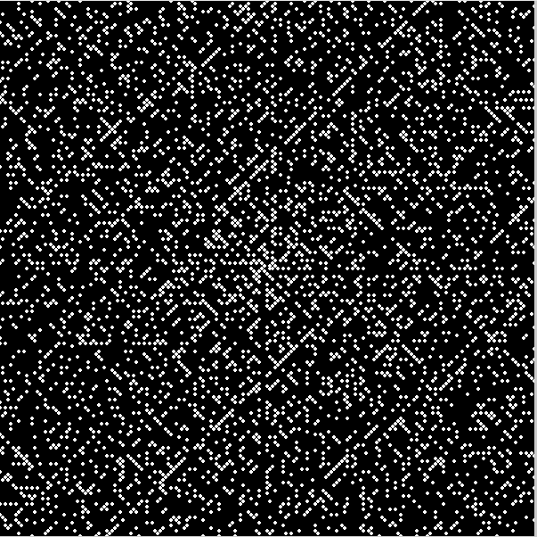
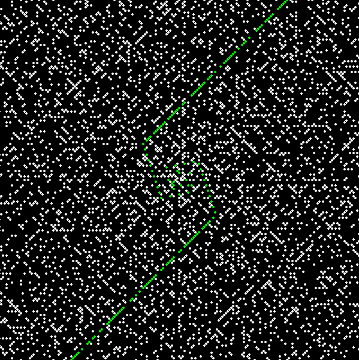
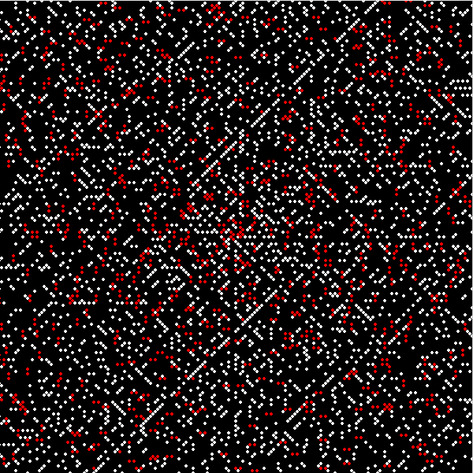

# Ulam-Spiral-Prime-Categories

A Pygame-based visualization of the Ulam spiral, highlighting different categories of prime numbers: twin primes, safe primes, and quadratic primes.

## Overview

This project uses Pygame to generate an Ulam spiral, a graphical representation that arranges numbers in a spiral pattern. Prime numbers are highlighted, with different colors to distinguish between types:
- **Quadratic Primes** (green): Primes of the form n^2 + n + 41
- **Twin Primes** (red): Primes that form twin pairs (p, p+2)
- **Safe Primes** (blue): Primes of the form 2p + 1, where p is also prime
- **Default Primes** (white): Primes that do not fall into the above categories

## Features

- **Visual Representation**: A unique view of the distribution of prime numbers using the Ulam spiral pattern.
- **Color-Coded Categories**: Visual distinctions for prime categories make patterns easy to identify.
- **Interactive Display**: Runs a Pygame window that allows you to watch the spiral generate in real time.

## Installation

1. **Clone the repository:**
    ```bash
    git clone https://github.com/yourusername/Ulam-Spiral-Prime-Categories.git
    cd Ulam-Spiral-Prime-Categories
    ```

2. **Install Pygame** if not already installed:
    ```bash
    pip3 install pygame
    ```

## Usage

Run the script with Python to open the Pygame window and start the visualization:

```bash
python3 Ulam-Spiral-Prime-Categories.py
```

The program will open a 600x600 window displaying the Ulam spiral. Prime numbers will appear in different colors based on their category.

## Code Details

- **Prime Categories**: Implemented with functions to check and categorize each prime.
- **Ulam Spiral Drawing**: Uses a grid pattern to map numbers in a spiral with dynamic positioning.
- **Event Handling**: Supports quitting the program via window controls.

## Example Output

| Ulam Spiral - All Primes in White | Ulam Spiral - Quadratic Primes in Green | Ulam Spiral - Twin Primes in Red |
|:---------------------------------:|:--------------------------------------:|:--------------------------------:|
|  |  |  |
| *Ulam Spiral - All Primes in White* | *Ulam Spiral - Quadratic Primes in Green* | *Ulam Spiral - Twin Primes in Red* |


## Requirements

- Python 3.x
- Pygame

## Acknowledgments

- [Ulam Spiral](https://en.wikipedia.org/wiki/Ulam_spiral) on Wikipedia for the concept.
- Inspiration from mathematical visualizations of prime numbers.

## Future Development Ideas

This project is a work in progress, and there are many opportunities for future enhancements. Below are some potential directions for development:

- **Additional Prime Categories**: Expand the categorization of prime numbers by including more types, such as:
  - **Mersenne primes** (primes of the form \( 2^n - 1 \)).
  - **Fermat primes** (primes of the form \( 2^{2^n} + 1 \)).
  - **Cullen primes** (primes of the form \( n \cdot 2^n + 1 \)).
  - **Sophie Germain primes** (primes where \( 2p + 1 \) is also prime).

- **Interactive Features**: Add interactive elements to allow users to customize the spiral or view specific categories of primes dynamically.

- **Optimized Prime Checking**: Explore ways to improve the performance of prime number detection, especially for larger numbers. This could include the use of advanced algorithms like the **Sieve of Eratosthenes** or **AKS primality test**.

- **Visual Enhancements**: Experiment with other graphical representations of the Ulam spiral and prime numbers, such as adding animations, gradients, or different geometric patterns.

- **Community Suggestions**: Incorporate ideas and feedback from the community to continually improve the project. Feel free to submit your own suggestions via issues or pull requests.

We welcome contributions from anyone interested in expanding this project and adding new features to enhance the visualization and understanding of prime numbers!


## License

This library is released under the GNU Lesser General Public License (LGPL) version 2.1 or any later version.

You can redistribute it and/or modify it under the terms of the LGPL as published by the Free Software Foundation. For more details, see the LICENSE file included in this repository, or visit [http://www.gnu.org/licenses/lgpl-2.1.html](http://www.gnu.org/licenses/lgpl-2.1.html).


Contributing
Contributions are welcome! Please open an issue or submit a pull request for any improvements, bug fixes, or new features.

Support
For any questions or issues, please open an issue on the repository.

